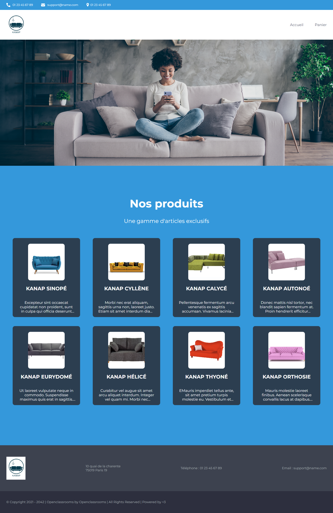
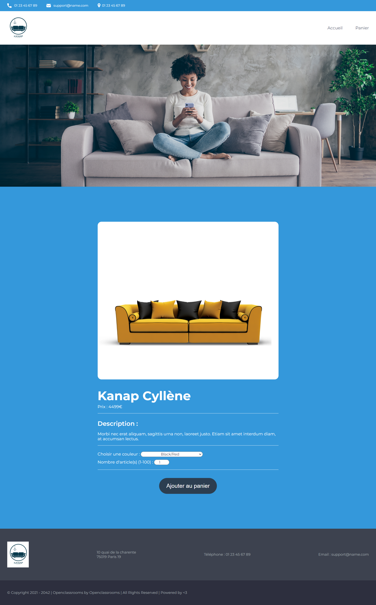
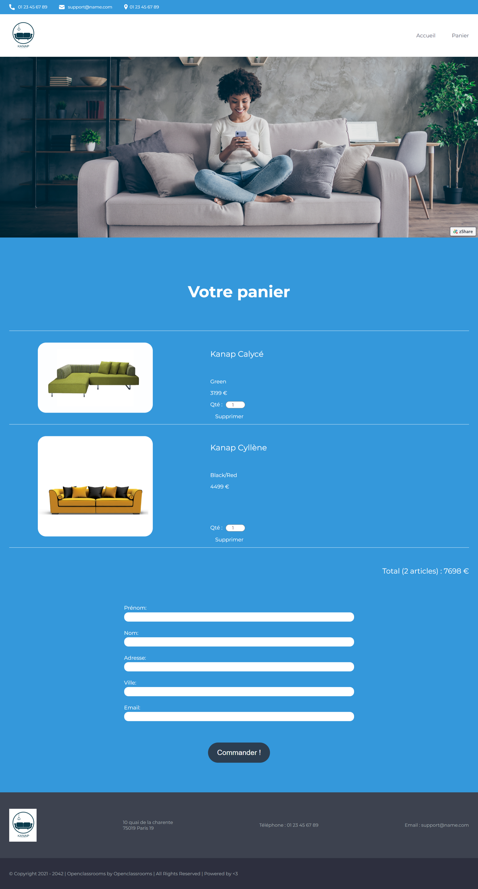
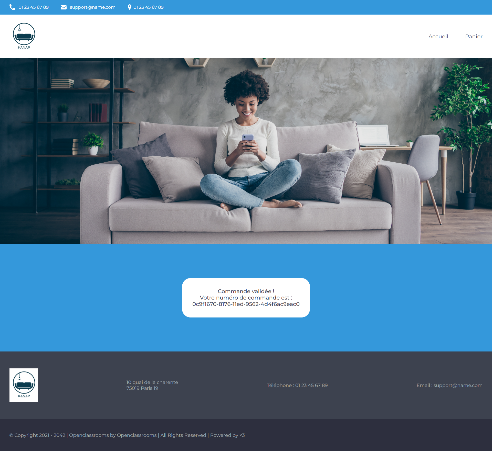

# Kanap #

### Visitez le projet réalisé <a href="https://greenbeetlestore.github.io/Kanap.v.2.0/">ici : https://greenbeetlestore.github.io/Kanap.v.2.0/</a>

## Instructions d'installation :

Il s'agit du serveur "frontend" et "backend" pour le projet 5 du parcours développeur Web.

<b>Entrez d'abord dans le dossier "back" pour exécuter "node server" = `Listening on port 3000`.

Deuxièmement, entrez dans le dossier "front" et lancez "Go Live". La page sera affichée à : http://127.0.0.1:5500/ </b>

### Back end Prerequisites ###

   You will need to have Node and `npm` installed locally on your machine.

### Back end Installation ###

  Clone this repo. From the "back" folder of the project, run `npm install`. You can then run the server with `node server`. 
  The server should run on `localhost` with default port `3000`. If the server runs on another port for any reason, this is printed to the console when the server starts, e.g. `Listening on port 3001`.
  
## Présentation du projet

### Voir la <a href="https://docs.google.com/presentation/d/1imHJc8YmTk-2z4Vg8DOkN4w1LcY8AQgeRVlI90UvjPA/edit?usp=sharing"> Présentation du projet ici 👈 </a>

======================================================================

# P5 - Construisez un site e-commerce en JavaScript

https://openclassrooms.com/fr/paths/556/projects/675/assignment

## Scénario

Vous êtes en poste dans une agence de développement web depuis quelques semaines maintenant. Après avoir réalisé avec succès l’intégration de quelques sites web (HTML/CSS), on vous confie une nouvelle mission.

Votre client est Kanap, une marque de canapés qui vend ses produits depuis sa boutique exclusivement. Aujourd’hui, celle-ci souhaiterait avoir une plateforme de e-commerce en plus de sa boutique physique pour vendre ses produits sur Internet.

Dans le cadre de cette mission, vous travaillez avec une équipe constituée de :

· Corinne, le CTO de l’agence ;

· Frank, le développeur front-end qui s’est chargé d’intégrer la maquette statique du site ;

· Bilal, le développeur back-end qui implémente l’API à laquelle est connecté le front-end.

======================================================================

Corinne vous envoie un e-mail pour vous briefer sur la mission :

<b>De</b> : Corinne

<b>À</b> : Vous

<b>Objet</b> : Site e-commerce Kanap 
 

Hello !

Comme on en a discuté hier, voici les informations pour que tu puisses démarrer l’implémentation du site de Kanap de manière dynamique. 

Voici les différentes tâches que tu vas devoir mener à bien :

· Unifier les travaux déjà réalisés par l’équipe en intégrant dynamiquement les éléments de l’API dans les différentes pages web avec JavaScript. Le code du front-end et de l’API est disponible sur <a href="https://github.com/OpenClassrooms-Student-Center/P5-Dev-Web-Kanap">ce repo</a>.

· Mettre en place un plan de test d’acceptation à partir de ce <a href="https://s3.eu-west-1.amazonaws.com/course.oc-static.com/projects/DWJ_FR_P5/DW+P5+-+Modele+plan+tests+acceptation.xlsx">template</a> que nous avons pour habitude d’utiliser.

Pour plus de précisions, voici les <a href="https://course.oc-static.com/projects/DWJ_FR_P5/DW+P5+-+Specifications+fonctionnelles.pdf">spécifications techniques et fonctionnelles</a> du projet. Tu pourras y trouver tous les détails de celui-ci, les attentes pour chaque page du site web et les détails de l’API. 

N'hésite pas à venir me voir si tu as la moindre question, ma porte est toujours ouverte.

Bonne journée,

Corinne

======================================================================

Un peu plus tard, Frank vous envoie un e-mail pour vous apporter quelques précisions complémentaires sur son travail :

<b>De</b> : Frank

<b>À</b> : Vous

<b>Objet</b> : Maquettes statiques du site de Kanap 
 

Salut,

Visiblement c’est le moment pour toi de rejoindre le projet ! Je viens donc te donner quelques informations sur la partie que j’ai pu réaliser, pour t’aider lors de ton développement.

4 pages ont été mises en place : page d’accueil, page Produit, page Panier et la page Confirmation. Sur l’ensemble des pages, toutes les parties statiques sont en place, elles sont donc prêtes à recevoir le contenu dynamique.

Aussi, sur chaque page, un exemple de la partie dynamique est systématiquement donné ; de cette façon, tu n’as pas à t’occuper de la mise en place de la structure HTML ni du style CSS, tout est déjà fait. Tu n’as plus qu’à t’occuper d’intégrer ces éléments dynamiquement grâce à JS et l’API.

Enfin, dans le code HTML j’ai intégré des “id” dans différentes balises, cela devrait t’aider à intégrer les éléments dynamiques. Avec tout ça, normalement tu n’auras pas besoin de toucher au code HTML/CSS.

Bon développement !

Frank

======================================================================

 

## Compétences évaluées

· Gérer des événements JavaScript

· Interagir avec un web service avec JavaScript

· Valider des données issues de sources externes

· Créer un plan de test pour une application
 

## Aperçu du résultat

======================================================================

# <a href="https://course.oc-static.com/projects/DWJ_FR_P5/DW+P5+-+Etapes+cles.pdf">Étapes clés – Projet 5 du parcours Développeur web.</a>

## Implémentez un site e-commerce dynamique

Besoin d’indications pour avancer dans votre projet ? Suivez les étapes clés proposées ci-dessous !
  
## Recommandations générales

  Vous allez écrire du code JS qui sera découpé en plusieurs fonctions. L’idée n’est pas de commenter chaque ligne de code, mais de commenter les choses de façon plus générale. Pour cela, il est possible de commenter le code, fonction par fonction, grâce à JSDoc. Pour vous aider, lisez l’article <a href="https://buzut.net/bien-commenter-son-code/">Bien commenter son code</a>.
  
  
  
# Étape 1 : Prendre en main les maquettes HTML / CSS
5 % d’avancement

Avant de commencer, il est essentiel de prendre connaissance des éléments mis à disposition, notamment les différentes pages web mises en place.
  
## 🎯 Une fois cette étape réalisée, vous aurez :

● connaissance du fonctionnement / de la structuration des pages HTML / CSS.
  
## 📌 Recommandations :

● Affichez les 4 pages HTML fournies dans votre navigateur.

● Essayez d’afficher les éléments HTML commentés par Frank dans le code, ceci dans le seul et unique but de voir à quoi vont ressembler les choses à la fin. En effet, avant d’insérer des éléments HTML de façon dynamique dans le DOM grâce à JS, il est nécessaire de savoir quels éléments nous allons devoir insérer.
  
## ⚠️ Points de vigilance :

● Attention à bien analyser les pages HTML / CSS fournies. Tout a été prévu pour que vous n’ayez pas à y retoucher, inutile de recréer des éléments déjà conçus.

  

# Étape 2 : Manipuler l’API 
10 % d’avancement
  
Avant d’aller plus loin, il est essentiel de prendre connaissance des autres éléments mis à disposition, tels que l’API avec laquelle il va falloir travailler dans ce projet.
  
## 🎯 Une fois cette étape réalisée, vous aurez :

● connaissance du fonctionnement / de la structuration de l’API réalisée par Bilal.
  
## 📌 Recommandations :

● Bien prendre le temps de lire le ReadMe du repo GitHub fourni !
  
● Une fois l’API lancée, consultez l’URL renseignée dans les spécifications fonctionnelles et techniques du projet, dans le but de vérifier le bon fonctionnement de    celle-ci. L’idée ici est de voir, depuis votre navigateur par exemple, le JSON retourné par l’API, que ce soit lorsqu’on demande à l’API l’ensemble des produits, ou bien seulement un produit précis (via son id).
  
## ⚠️ Points de vigilance :

● Attention à bien lancer l’API avant de vouloir l’utiliser.

  

# Étape 3 : Insérer les produits dans la page d’accueil
20 % d’avancement

Vous pouvez maintenant intégrer l’ensemble des produits de l’API dans la page du site web.
  
## 🎯 Une fois cette étape réalisée, vous aurez :

● une page d’accueil contenant les produits de l’API.
  
## 📌 Recommandations :

● En JS, commencez par requêter l’API pour lui demander l’ensemble des produits ; récupérer la réponse émise, et parcourir celle-ci pour insérer chaque élément         (chaque produit) dans la page d’accueil (dans le DOM).
  
## ⚠️ Points de vigilance :

● Attention, ici il est question d’afficher les produits de façon dynamique, pas de façon statique.

● Attention de bien utiliser l’ensemble des éléments nécessaires pour chaque produit, on a vite fait d’oublier d’utiliser les textes alternatifs, par exemple.
  
## 📃 Ressources :

● La partie 2 (Communiquez via une API avec un service web) du cours “<a href="https://openclassrooms.com/fr/courses/5543061-ecrivez-du-javascript-pour-le-web">Écrivez du JavaScript pour le Web</a>” devrait vous aider à récupérer les données depuis l’API.

● Le chapitre “<a href="https://openclassrooms.com/fr/courses/6175841-apprenez-a-programmer-avec-javascript/6279104-utilisez-la-bonne-boucle-pour-repeter-les-taches-for-while">Utilisez la bonne boucle pour répéter les tâches (for, while)</a>” du cours “<a href="https://openclassrooms.com/fr/courses/6175841-apprenez-a-programmer-avec-javascript">Apprenez à programmer avec JavaScript</a>” devrait vous aider à parcourir la réponse envoyée par l’API.

● Vous pourrez aussi trouver des informations intéressantes dans le chapitre <a href="https://openclassrooms.com/fr/courses/5543061-ecrivez-du-javascript-pour-le-web/5577491-modifiez-le-dom">Modifiez le DOM</a> du cours “<a href="https://openclassrooms.com/fr/courses/5543061-ecrivez-du-javascript-pour-le-web">Écrivez du JavaScript pour le Web</a>”.

  
  
# Étape 4 : Faire le lien entre un produit de la page d’accueil et la page Produit 
30 % d’avancement

Avant de penser à la page Produit, il va falloir prévoir ce qu’il faut sur la page d’accueil pour que, une fois sur la page Produit, vous puissiez savoir lequel des   différents produits de l’API il faut afficher.
  
## 🎯 Une fois cette étape réalisée, vous aurez :

● la possibilité d’ouvrir une page Produit en sachant quel produit afficher.
  
## 📌 Recommandations :

● Renseignez-vous sur le terme “<a href="https://waytolearnx.com/2019/10/comment-recuperer-les-parametres-durl-en-javascript.html">URLSearchParams</a>”. C’est grâce à cette notion que votre page Produit va pouvoir “savoir” lequel des différents produits de l’API afficher.

● Pour chacun des produits de la page d’accueil, il va falloir bien paramétrer la balise “a” et son attribut “href”.
  
## ⚠️ Points de vigilance :

● Attention à bien utiliser URLSearchParams pour passer l’id d’une page à une autre, et non pas localStorage.
  
## 📃 Ressources :

● Voici un court article mais relativement clair sur URLSearchParams : <a href="https://waytolearnx.com/2019/10/comment-recuperer-les-parametres-durl-en-javascript.html">Comment récupérer les paramètres d’URL en JavaScript</a>.

● <a href="https://developer.mozilla.org/fr/docs/Web/API/URLSearchParams">La documentation MDN sur URLSearchParams</a>.

  
  
# Étape 5 : Récupérer l’id du produit à afficher
35 % d’avancement

Avant de pouvoir afficher les détails d’un produit, il va falloir savoir de quel produit on parle ; nous allons donc récupérer l’id du produit ayant été cliqué sur     la page d’accueil.
  
## 🎯 Une fois cette étape réalisée, vous aurez :

● la connaissance du produit à afficher sur la page Produit.
  
## 📌 Recommandations :

● Vous êtes maintenant en mesure de savoir lequel des produits de l’API nous allons vouloir afficher dans la page Produit. Il va donc falloir récupérer l’id du produit en question dans l’URL (<a href="https://waytolearnx.com/2019/10/comment-recuperer-les-parametres-durl-en-javascript.html">URLSearchParams</a>).

## 📃 Ressources :

● Comme lors de l’étape précédente, l’article sur URLSearchParams vous sera utile : <a href="https://waytolearnx.com/2019/10/comment-recuperer-les-parametres-durl-en-javascript.html">Comment récupérer les paramètres d’URL en JavaScript</a>.

  
  
# Étape 6 : Insérer un produit et ses détails dans la page Produit
45 % d’avancement

Nous avons maintenant l’id du produit à afficher, ceci permettant de requêter l’API dans le but de récupérer les différentes informations du produit en question.
  
## 🎯 Une fois cette étape réalisée, vous aurez :

● une page Produit complétée, à partir des données de l’API.
  
## 📌 Recommandations :

● Interroger l’API pour récupérer les détails du produit.

● Insérer ces détails dans la page Produit (dans le DOM).
  
## ⚠️ Points de vigilance :

● Attention de bien utiliser l’API, l’idée ici est de récupérer un seul et unique produit, et non pas l’ensemble des produits.
  
## 📃 Ressources :

● Se référer aux <a href="https://course.oc-static.com/projects/DWJ_FR_P5/DW+P5+-+Specifications+fonctionnelles.pdf">spécifications fonctionnelles et techniques</a> du projet pour savoir comment requêter l’API.

  
  
# Étape 7 : Ajouter des produits dans le panier 
55 % d’avancement

La page Produit est en place, celle-ci affiche les détails d’un produit cliqué à partir de la page d’accueil. Il faut maintenant gérer la possibilité d’ajouter ce produit au panier.
  
## 🎯 Une fois cette étape réalisée, vous aurez :

● la possibilité d’ajouter des produits dans votre panier.
  
## 📌 Recommandations :

● Techniquement parlant, le panier peut être un array qui contiendrait trois choses :

    ○ l’id du produit ;
    
    ○ la quantité du produit ;
    
    ○ la couleur du produit.
    
● Il est nécessaire d’utiliser localStorage pour pouvoir accéder à cet array depuis la page Panier.

● Lorsqu’on ajoute un produit au panier, si celui-ci n'était pas déjà présent dans le panier, on ajoute un nouvel élément dans l’array.

● Lorsqu’on ajoute un produit au panier, si celui-ci était déjà présent dans le panier (même id + même couleur), on incrémente simplement la quantité du produit        correspondant dans l’array.
  
## ⚠️ Points de vigilance :

● Dans localStorage, attention de ne pas multiplier inutilement des éléments identiques.
  
## 📃 Ressources :

● Vous devriez lire <a href="https://tutowebdesign.com/localstorage-javascript.php">cet article sur localStorage</a>. Voici également la documentation MDN à ce sujet : <a href="https://developer.mozilla.org/fr/docs/Web/API/Window/localStorage">Window.localStorage</a>.

  
  
# Étape 8 : Afficher un tableau récapitulatif des achats dans la page Panier
65 % d’avancement

Les produits sont ajoutés au panier, mais cela reste encore invisible pour l’utilisateur. Dans cette étape, nous allons afficher le contenu du panier dans la page     Panier.
  
## 🎯 Une fois cette étape réalisée, vous aurez :

● une page Panier affichant tous les articles précédemment ajoutés.
  
## 📌 Recommandations :

● Depuis la page Panier, récupérer le panier (l’array) via localStorage.
  
● Parcourir l’array.
  
● Créer et insérer des éléments dans la page Panier.
  
## ⚠️ Points de vigilance :

● Attention de ne pas dupliquer inutilement les éléments dans le tableau récapitulatif (le panier). S’il y a plusieurs produits identiques (même id + même couleur),    cela ne doit donner lieu qu’à une seule ligne dans le tableau.
  
## 📃 Ressources :

● À nouveau, le chapitre “<a href="https://openclassrooms.com/fr/courses/6175841-apprenez-a-programmer-avec-javascript/6279104-utilisez-la-bonne-boucle-pour-repeter-les-taches-for-while">Utilisez la bonne boucle pour répéter les tâches (for, while)</a>” du cours “<a href="https://openclassrooms.com/fr/courses/6175841-apprenez-a-programmer-avec-javascript">Apprenez à programmer avec JavaScript</a>” devrait vous aider.

  
  
# Étape 9 : Gérer la modification et la suppression de produits dans la page Panier 
75 % d’avancement

Les produits présents dans le panier sont affichés sur la page Panier.

Maintenant, il faut permettre à l’utilisateur de modifier la quantité ou de supprimer un produit dans le panier.
  
## 🎯 Une fois cette étape réalisée, vous aurez :

● la possibilité, sur la page Panier, de modifier la quantité ou de supprimer un produit.
  
## 📌 Recommandations :

● Concernant la modification, il va falloir recourir à l'événement de modification (addEventListener de type change) pour observer le changement de la quantité.

● Aussi, la méthode Element.closest() devrait permettre de cibler le produit que vous souhaitez supprimer (où dont vous souhaitez modifier la quantité) grâce à son     identifiant et sa couleur.
  
## ⚠️ Points de vigilance :

● Attention à bien penser à modifier le DOM, mais aussi localStorage, sinon les modifications effectuées dans le panier ne seront pas conservées en cas de changement de page / de rafraîchissement de la page.

● Pour récupérer l’ID du produit et modifier sa quantité ou le supprimer, <b>ne répétez pas les données</b> du produit dans les éléments enfants. Récupérez plutôt le data-id et le data-color dans l’élément parent (l’article cart__item) grâce à Element.closest(). Ainsi, les données du produit sont centralisées à un seul endroit du code : l’élément englobant toutes les informations du produit.

## 📃 Ressources :

● <a href="https://developer.mozilla.org/fr/docs/orphaned/Web/API/HTMLOrForeignElement/dataset">Cette documentation</a> sur la propriété dataset pourrait vous faciliter un peu les choses.

● Voici <a href="https://www.javascripttutorial.net/javascript-dom/javascript-change-event/">un article</a> parlant de l’utilisation de addEventListener de type change.

● <a href="https://developer.mozilla.org/fr/docs/Web/API/Element/closest">La documentation MDN de la méthode Element.closest()</a>.

  
  
# Étape 10 : Passer la commande 
85 % d’avancement

Nous avons presque terminé, l’utilisateur doit pouvoir valider sa commande, c’est l’objectif de cette étape.
  
## 🎯 Une fois cette étape réalisée, vous aurez :

● la possibilité, sur la page Panier, de saisir vos coordonnées puis de confirmer votre commande.
  
## 📌 Recommandations :

● Récupérer et analyser les données saisies par l’utilisateur dans le formulaire.

● Afficher un message d’erreur si besoin (par exemple lorsqu’un utilisateur renseigne “bonjour” dans le champ “e-mail”).

● Constituer un objet contact (à partir des données du formulaire) et un tableau de produits.
  
## ⚠️ Points de vigilance :

● Attention à bien vérifier les données saisies par l’utilisateur.

● Lors de la vérification des données via des regex, attention à bien mener des tests pour vérifier le bon fonctionnement des regex.

● Ne pas oublier d’afficher un message d’erreur si nécessaire.
  
## 📃 Ressources :

● La partie 2 (Communiquez via une API avec un service web) du cours “<a href="https://openclassrooms.com/fr/courses/5543061-ecrivez-du-javascript-pour-le-web">Écrivez du JavaScript pour le Web</a>” devrait vous aider à envoyer/récupérer des données à/depuis l’API.
  
● L’article <a href="https://www.pierre-giraud.com/javascript-apprendre-coder-cours/introduction-expression-reguliere-rationnelle/">Introduction aux expressions régulières ou expressions rationnelles en JavaScript</a> devrait vous permettre de mieux comprendre comment vérifier les données saisies par un utilisateur. Les regex peuvent parfois être complexes à écrire, ne pas hésiter à mener des recherches à ce sujet (exemple : expressions régulières JavaScript email).
  
● Pour savoir comment faire une requête POST en JavaScript, lisez <a href="https://fr.javascript.info/fetch#requetes-post">la documentation sur ce sujet</a>.

● Se référer aux <a href="https://course.oc-static.com/projects/DWJ_FR_P5/DW+P5+-+Specifications+fonctionnelles.pdf">spécifications fonctionnelles et techniques</a> du projet pour savoir comment requêter l’API.

  
  
# Étape 11 : Afficher le numéro de commande
90 % d’avancement

Nous voilà au bout des choses, maintenant que nous pouvons passer commande, il ne reste plus qu’à afficher le numéro de ladite commande.
  
## 🎯 Une fois cette étape réalisée, vous aurez :

● après confirmation de la commande, un affichage du numéro de commande en question.
  
## 📌 Recommandations :

● Effectuer une requête POST sur l’API et récupérer l’identifiant de commande dans la réponse de celle-ci.

● Rediriger l’utilisateur sur la page Confirmation, en passant l’id de commande dans l’URL, dans le but d’afficher le numéro de commande.

● Si ce numéro doit être affiché, celui-ci ne doit pas être conservé / stocké.
  
## ⚠️ Points de vigilance :

● Attention à bien vérifier par deux fois la requête attendue par l’API, aucune erreur ne sera tolérée par celle-ci.

● Attention, si le numéro doit être affiché, celui-ci ne doit pas être conservé / stocké.

  
  
# Étape 12 : Mettre en place le plan de test d’acceptation
100 % d’avancement

Le site web étant en place, il est maintenant l’heure de mettre en place un plan de test dans le but de vérifier que toutes les fonctionnalités ont bien été           implémentées, et que celles-ci sont fonctionnelles.
  
## 🎯 Une fois cette étape réalisée, vous aurez :

● un plan de test d’acceptation complété.
  
## 📌 Recommandations :

● Maintenant que l'ensemble du code JS est écrit, il faut mettre en place le plan de test d’acceptation. L’idée principale est de vérifier l’alignement entre le cahier des charges / les spécifications fonctionnelles, et le produit réalisé.
  
## ⚠️ Points de vigilance :

● Attention de ne pas oublier de fonctionnalités dans l’écriture des tests.
  
## 📃 Ressources :

● Vous pouvez trouver de nombreuses documentations concernant les différents tests, et notamment les tests d’acceptation. Voici <a href="https://www2.stardust-testing.com/blog-fr/la-valeur-des-tests-de-validation">un article sur les tests d'acceptations</a>.

  
  
# 🎉 Projet terminé !

======================================================================

  

# <a href="https://course.oc-static.com/projects/DWJ_FR_P5/DW+P5+-+Specifications+fonctionnelles.pdf">MVP – Spécifications fonctionnelles et techniques du site de Kanap</a>

## SOMMAIRE

    Architecture générale
    
    Planification de tests
    
    Informations complémentaires
    
    Types de données
    
    Technologies utilisées
    
    URL des API
    
    Paramètres des API
    
    Validation des données
    
## Architecture générale

L’application web sera composée de 4 pages :

● Une page d’accueil montrant (de manière dynamique) tous les articles disponibles à la vente.

● Une page “produit” qui affiche (de manière dynamique) les détails du produit sur lequel l'utilisateur a cliqué depuis la page d’accueil. Depuis cette page, l’utilisateur peut sélectionner une quantité, une couleur, et ajouter le produit à son panier.

● Une page “panier”. Celle-ci contient plusieurs parties :

      ○ Un résumé des produits dans le panier, le prix total et la possibilité de modifier la quantité d’un produit sélectionné ou bien de supprimer celui-ci.
      
      ○ Un formulaire permettant de passer une commande. Les données du formulaire doivent être correctes et bien formatées avant d'être renvoyées au back-end. Par exemple, pas de chiffre dans un champ prénom.
      
● Une page “confirmation” :

      ○ Un message de confirmation de commande, remerciant l'utilisateur pour sa commande, et indiquant l'identifiant de commande envoyé par l’API.
  
## Planification de tests

Planifiez une suite de tests d’acceptation pour couvrir l’ensemble des fonctionnalités listées dans ce document (spécifications fonctionnelles et techniques Kanap).

Voici le modèle à partir duquel écrire ce plan : <a href="https://s3.eu-west-1.amazonaws.com/course.oc-static.com/projects/DWJ_FR_P5/DW+P5+-+Modele+plan+tests+acceptation.xlsx">Modèle de plan de test</a>.

## Informations complémentaires

### La page d’accueil
  
Cette page présente l’ensemble des produits retournés par l’API.

Pour chaque produit, il faudra afficher l’image de celui-ci, ainsi que son nom et le début de sa description.

En cliquant sur le produit, l’utilisateur sera redirigé sur la page du produit pour consulter celui-ci plus en détail.
  
### La page Produit
  
Cette page présente un seul produit ; elle aura un menu déroulant permettant à l'utilisateur de choisir une option de personnalisation, ainsi qu’un input pour         saisir la quantité. Ces éléments doivent être pris en compte dans le panier.
    
### La page Panier
  
Sur cette page, l’utilisateur va pouvoir modifier la quantité d’un produit de son panier ; à ce moment, le total du panier devra bien se mettre à jour.

L’utilisateur aura aussi la possibilité de supprimer un produit de son panier, le produit devra donc disparaître de la page.

Les inputs des utilisateurs doivent être analysés et validés pour vérifier le format et le type de données avant l’envoi à l’API. Il ne serait par exemple pas         recevable d’accepter un prénom contenant des chiffres, ou une adresse e-mail ne contenant pas de symbole “@”. En cas de problème de saisie, un message d’erreur         devra être affiché en dessous du champ correspondant.

Attention à ne pas stocker le prix des articles en local. Les données stockées en local ne sont pas sécurisées et l’utilisateur pourrait alors modifier le prix         lui-même.
  
### La page Confirmation
  
Sur cette page, l'utilisateur doit voir s’afficher son numéro de commande. Il faudra veiller à ce que ce numéro ne soit stocké nulle part.
    
### Le code source
  
Celui-ci devra être indenté et utiliser des commentaires en début de chaque fonction pour décrire son rôle. Il devra également être découpé en plusieurs fonctions     réutilisables (nommées). Une fonction doit être courte et répondre à un besoin précis. Il ne faudrait pas avoir de longues fonctions qui viendraient répondre à         plusieurs besoins à la fois. Exemple : il ne serait pas accepté de mettre une seule et unique fonction en place pour collecter, traiter et envoyer des données.
    
### API
  
Concernant l’API, des promesses devront être utilisées pour éviter les callbacks. Il est possible d’utiliser des solutions alternatives, comme fetch, celle-ci         englobant la promesse.

L’API n’est actuellement que dans sa première version. La requête post qu’il faudra formuler pour passer une commande ne prend pas encore en considération la           quantité ni la couleur des produits achetés.

## Fonctionnement du panier

Dans le panier, les produits doivent toujours apparaître de manière regroupée par modèle et par couleur.

Si un produit est ajouté dans le panier à plusieurs reprises, avec la même couleur, celui-ci ne doit apparaître qu’une seule fois, mais avec le nombre                 d’exemplaires ajusté.

Si un produit est ajouté dans le panier à plusieurs reprises, mais avec des couleurs différentes, il doit apparaître en deux lignes distinctes avec la couleur et       la quantité correspondantes indiquées à chaque fois.

## Types de données </h4>

Tous les produits possèdent les attributs suivants :

        Champ : colors                      Type : array of string
        Champ : id                          Type : string
        Champ : name                        Type : string
        Champ : price                       Type : number
        Champ : imageUrl                    Type : string
        Champ : description                 Type : string
        Champ : altTxt                      Type : string

## Technologies utilisées

HTML, CSS, JavaScript, Node, GitHub, VS Code, Chrome, Firefox.

## URL des API

● Catalogue de canapés : http://localhost:3000/api/products

● ID des produits du catalogue : 	http://localhost:3000/api/products/{id}

● Pour envoyer la commande et recevoir le Nº. de commande : http://localhost:3000/api/products/order

La commande envoyé pour l'enregistrer doit être au format JSON suivant :
        
          {
            contact{
              firstName: <string>,
              lastName: <string>,
              address: <string>,
              city; <string>,
              email: <string>
            },
            products: [<string>]
          }

## Validation des données
  
Pour les routes POST, l’objet contact envoyé au serveur doit contenir les champs firstName, lastName, address, city et email. Le tableau des produits envoyé au         back-end doit être un array de strings product-ID. Les types de ces champs et leur présence doivent être validés avant l’envoi des données au serveur.

